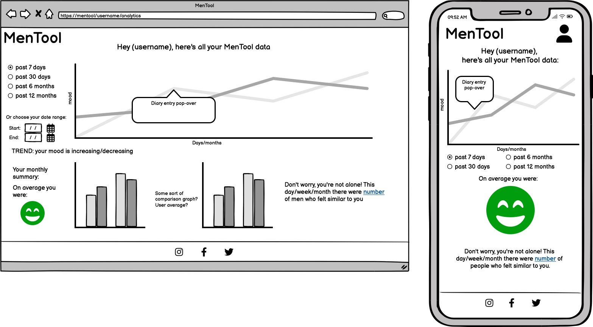

# MenTool
By Mind Menders
Developers : Dan Morriss, Agy Luczak, Tomislav Dukez, Ben Gilbert, Jamie Phelps and Stanley Owanta

[Website Link](https://mentool-2af96fd6f7e7.herokuapp.com/)

# Table of Content

1. [Project Discription](#project-description)
2. [Project Goals](#project-goals)
    1. [User Goals](#user-goals)
    2. [Site Owner Goals](#site-owner-goals)
3. [User Experience](#user-experience)
    1. [Target Audience](#target-audience)
    2. [User Requrements and Expectations](#user-requrements-and-expectations)
    3. [User Stories](#user-stories)
4. [Design](#design)
    1. [Design Choices](#design-choices)
    2. [Colour](#colour)
    3. [Fonts](#fonts)
    4. [Wireframes](#wireframes)
5. [Technologies Used](#technologies-used)
    1. [Languages](#languages)
    2. [Frameworks & Tools](#frameworks-&-tools)
6. [Features](#features)
    1. [Existing Features](#existing-features)
    2. [Future Features](#future-features)
7. [Testing](#validation)
    1. [HTML Validation](#HTML-validation)
    2. [CSS Validation](#CSS-validation)
    3. [Accessibility](#accessibility)
    4. [Mock up](#mock-up)
    5. [Performance](#performance)
    6. [Device testing](#performing-tests-on-various-devices)
    7. [Browser Compatibility](#browser-compatability)
    8. [Testing User Stories](#testing-user-stories)
8. [Bugs](#Bugs)
9. [Deployment](#deployment)
10. [Credits](#credits)
11. [Acknowledgements](#acknowledgements)

# Project Description
MenTool is more than just an app; it's your new companion on a journey towards greater self-awareness and emotional well-being. We understand that life throws curveballs, and sometimes, keeping track of how you feel can make all the difference. That's where we come in. Whether you’re riding high, feeling low, or just cruising somewhere in between, MenTool is here to help you understand and navigate your emotional world with greater clarity and confidence. Take a moment each day to check in with yourself. Log your mood, understand patterns, and discover insights that can help you lead a more balanced and fulfilling life. Remember, this is a safe space to be honest and open about how you’re feeling - no judgments, no pressure.

# Project Goals

## User Goals
* To be able to track moods
* To see previous mood patterns 
* To be able to create an account
* To be able to log in and out 

## Site Owner Goals
* To help users track their moods
* To help users realise what sort of mood they are in
* Provide an account feature for users to keep thier infomation safe

# User Experience

## Target Audience
* Users who want to start tracking their feelings
* Users who want to continue to track their feelings
* Users who want to use a login in

## User Requrements and Expectations

## User Stories
### First Time User
1. As a first time user, I want to be able to track my mood
2. As a first time user, I want to be able to create an account
3. As a first time user, I want to be able to navigate the app easily 

### Returning User
4. As a returning user, I want to be able to continue the track my mood
5. As a returning user, I want to be able to see my mood history
6. As a returning user, I want to be able to log into my account
7. As a returning user, I want to be able to find out about mental health sites
8. As a returning user, I want to be able to find out who built the app

### Website Owner
9. As the App owner, we want users to find informantion about mental health
10. As the App owner, we want users to be able to track thier moods
11. As the App owner, we want users to find out about the devs who built the site

# Design
## Design Choices

## Font Awesome
User <i class="fa-solid fa-user"></i>
Chart <i class="fa-solid fa-chart-line"></i>
Brain for track your mood? <i class="fa-solid fa-brain"></i>
Logout <i class="fa-solid fa-right-from-bracket"></i>
Home <i class="fa-solid fa-house"></i>
About us <i class="fa-solid fa-users"></i>

## Mood Icons
Very Happy <i class="fa-regular fa-face-grin-hearts"></i>
Happy <i class="fa-regular fa-face-smile-beam"></i>
Meh <i class="fa-regular fa-face-meh"></i>
Sad <i class="fa-regular fa-face-sad-tear"></i>
Very Sad <i class="fa-regular fa-face-sad-cry"></i>

## Colour

## Fonts
### Primary Font

### Secondary Font

## Wireframes

Landing Page

 

About Us

 
 

Account Home

 
 

Create Account and Login Page

 
 

Analytics

 
 

# Technologies Used
## Languages
* HTML
* CSS
* JavaScript
* Python

## Frameworks & Tools
* GitHub
* Bootstrap
* Balsamiq
* Google Fonts
* Font Awesome
* Favicon.io
* Django
* Heroku
* Jquery

# Features
## Existing Features
### Mood Tracker
The mood tracker allows the user the tracker their mood on the app by clicking on the relivant icons

User stories covered: 1, 10

### Account
The account feature allows the user to login and out of the app keep their data secure

User stories covered: 2, 4, 6

### Mood Analytics
The mood analytics feature allows the user to be able to keep a record of the moods that they've inputed in the mood tracker

User stories covered: 5

### GitHub Profile Link
The Github profile link allows the user to see the acounts of the devs that built the app and see their other work

User stories covered: 8, 11

### Navbar
The navbar allows the user to navigate around the app

User stories covered: 3

### Footer
The footer links back to the about us page which details the devs involved with the app

User stories covered: 8, 11

# Validation
I put my website through the following validation tools:

## HTML Validation

### CSS Validation: 

### Accessibility: 

### Mock up

### Performance

### Device testing
 

### Browser Compatibility

### Testing user stories
1.

| **Feature** | **Action** | **Expected Result** | **Actual Result** |
|-------------|------------|---------------------|-------------------|
|  |  |  |  |

2. 

| **Feature** | **Action** | **Expected Result** | **Actual Result** |
|-------------|------------|---------------------|-------------------|
|  |  |  |  |

3. 

| **Feature** | **Action** | **Expected Result** | **Actual Result** |
|-------------|------------|---------------------|-------------------|
|  |  |  |  |

4.

| **Feature** | **Action** | **Expected Result** | **Actual Result** |
|-------------|------------|---------------------|-------------------|
|  |  |  |  |

5.

| **Feature** | **Action** | **Expected Result** | **Actual Result** |
|-------------|------------|---------------------|-------------------|
|  |  |  |  |

6. 

| **Feature** | **Action** | **Expected Result** | **Actual Result** |
|-------------|------------|---------------------|-------------------|
|  |  |  |  |

7.

| **Feature** | **Action** | **Expected Result** | **Actual Result** |
|-------------|------------|---------------------|-------------------|
|  |  |  |  |

8. 

| **Feature** | **Action** | **Expected Result** | **Actual Result** |
|-------------|------------|---------------------|-------------------|
|  |  |  |  |

9.

| **Feature** | **Action** | **Expected Result** | **Actual Result** |
|-------------|------------|---------------------|-------------------|
|  |  |  |  |

10.

| **Feature** | **Action** | **Expected Result** | **Actual Result** |
|-------------|------------|---------------------|-------------------|
|  |  |  |  |

11.

| **Feature** | **Action** | **Expected Result** | **Actual Result** |
|-------------|------------|---------------------|-------------------|
|  |  |  |  |

12.

| **Feature** | **Action** | **Expected Result** | **Actual Result** |
|-------------|------------|---------------------|-------------------|
|  |  |  |  |

13.

| **Feature** | **Action** | **Expected Result** | **Actual Result** |
|-------------|------------|---------------------|-------------------|
|  |  |  |  |

14. 

| **Feature** | **Action** | **Expected Result** | **Actual Result** |
|-------------|------------|---------------------|-------------------|
|  |  |  |  |

15. 

| **Feature** | **Action** | **Expected Result** | **Actual Result** |
|-------------|------------|---------------------|-------------------|
|  |  |  |  |

16. 

| **Feature** | **Action** | **Expected Result** | **Actual Result** |
|-------------|------------|---------------------|-------------------|
|  |  |  |  |

## Bugs
| **Bug** | **Fix** |
| ----------- | ----------- |
|  |  |
|  |  |
|  |  | 
|  |  |
|  |  |

# Deployment

# Credits

## Content

## Media

## Code and Design

# Acknowledgements
