# MenTool
By Mind Menders
Developers : Dan Morriss, Agy Luczak, Tomislav Dukez, Ben Gilbert, Jamie Phelps, Stanley Owanta and Lesly Lopez


[Website Link](https://mentool-2af96fd6f7e7.herokuapp.com/)

# Table of Content

1. [Project Discription](#project-description)
2. [Project Goals](#project-goals)
    1. [User Goals](#user-goals)
    2. [Site Owner Goals](#site-owner-goals)
3. [User Experience](#user-experience)
    1. [Target Audience](#target-audience)
    2. [User Requrements and Expectations](#user-requrements-and-expectations)
    3. [User Stories](#user-stories)
4. [Design](#design)
    1. [Design Choices](#design-choices)
    2. [Colour](#colour)
    3. [Fonts](#fonts)
    4. [Wireframes](#wireframes)
5. [Technologies Used](#technologies-used)
    1. [Languages](#languages)
    2. [Frameworks & Tools](#frameworks-&-tools)
6. [Features](#features)
    1. [Existing Features](#existing-features)
    2. [Future Features](#future-features)
7. [Testing](#validation)
    1. [HTML Validation](#HTML-validation)
    2. [CSS Validation](#CSS-validation)
    3. [Accessibility](#accessibility)
    4. [Mock up](#mock-up)
    5. [Performance](#performance)
    6. [Device testing](#performing-tests-on-various-devices)
    7. [Browser Compatibility](#browser-compatability)
    8. [Testing User Stories](#testing-user-stories)
8. [Bugs](#Bugs)
9. [Deployment](#deployment)
10. [Credits](#credits)
11. [Acknowledgements](#acknowledgements)

# Project Description
MenTool is more than just an app; it's your new companion on a journey towards greater self-awareness and emotional well-being. We understand that life throws curveballs, and sometimes, keeping track of how you feel can make all the difference. That's where we come in. Whether you’re riding high, feeling low, or just cruising somewhere in between, MenTool is here to help you understand and navigate your emotional world with greater clarity and confidence. Take a moment each day to check in with yourself. Log your mood, understand patterns, and discover insights that can help you lead a more balanced and fulfilling life. Remember, this is a safe space to be honest and open about how you’re feeling - no judgments, no pressure.

# Project Goals

## User Goals
* To be able to track moods
* To see previous mood patterns 
* To be able to create an account
* To be able to log in and out 


## Site Owner Goals
* To help users track their moods
* To help users realise what sort of mood they are in
* Provide an account feature for users to keep thier infomation safe


# User Experience

## Target Audience
* Users who want to start tracking their feelings
* Users who want to continue to track their feelings
* Users who want to use a login in


## User Requrements and Expectations

## User Stories
### First Time User
1. As a first time user, I want to be able to track my mood
2. As a first time user, I want to be able to create an account
3. As a first time user, I want to be able to navigate the app easily 


### Returning User
4. As a returning user, I want to be able to continue the track my mood
5. As a returning user, I want to be able to see my mood history
6. As a returning user, I want to be able to log into my account
7. As a returning user, I want to be able to find out about mental health sites
8. As a returning user, I want to be able to find out who built the app

### Website Owner
9. As the App owner, we want users to find informantion about mental health
10. As the App owner, we want users to be able to track thier moods
11. As the App owner, we want users to find out about the devs who built the site

# Design
## Design Choices

## Font Awesome
* Login 
<br>
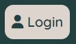
<br>
* User 
<br>

<br>
* Stats 
<br>

<br>
* Brain for track your mood? 
<br>
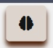
<br>
* Logout 
<br>

<br>
* Home 
<br>
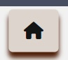
<br>
* About us 
<br>
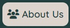 
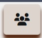
<br>

## Mood Icons
Very Happy <i class="fa-regular fa-face-grin-hearts"></i>
Happy <i class="fa-regular fa-face-smile-beam"></i>
Meh <i class="fa-regular fa-face-meh"></i>
Sad <i class="fa-regular fa-face-sad-tear"></i>
Very Sad <i class="fa-regular fa-face-sad-cry"></i>

## Colour
This colour palette combines deep navy blue (#010A26), dark teal (#224040), soft off-white (#EBF2F2), olive green (#595542), and light taupe (#BFBAAA) to create a harmonious and balanced aesthetic.  We chose these calm, earthly colours to reflect the app's purpose of tracking and reflecting on emotional states.

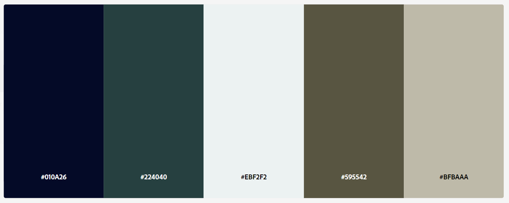


## Fonts
Audiowide, with its modern and tech-forward appearance, was used for headings to give the app a contemporary and professional look. In contrast, Quicksand, with its more approachable and readable style, was applied for body text, ensuring that longer texts are easy on the eyes and pleasant to read. The combination of these two fonts balances a modern, tech-forward look with approachability and ease of use, aligning well with the app’s purpose and its target user base.

### Audiowide Font


### Quicksand Font


## Wireframes
<details>
<summary>Landing Page</summary>
<br>
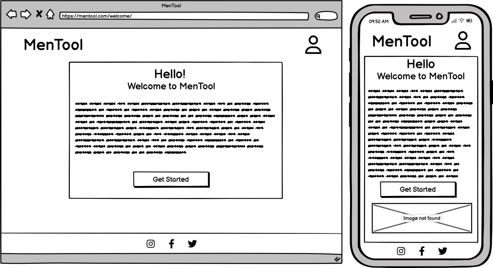
</details>

<details>
<summary>About Us</summary>
<br>
 
</details>

<details>
<summary>Account Home</summary>
<br>
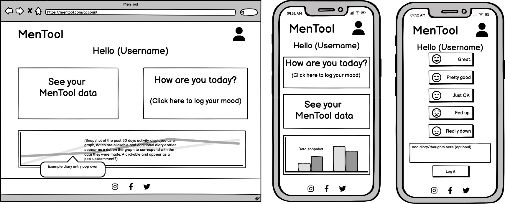 
</details>

<details>
<summary>Create Account and Login Page</summary>
<br>
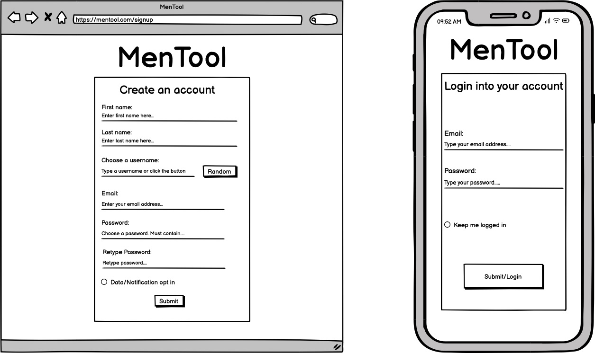 
</details>

<details>
<summary>Analytics</summary>
<br>
 
</details>

## Link Validation Gifs
<details>
<summary>About US</summary>
<br>

</details>

<details>
<summary>Login</summary>
<br>
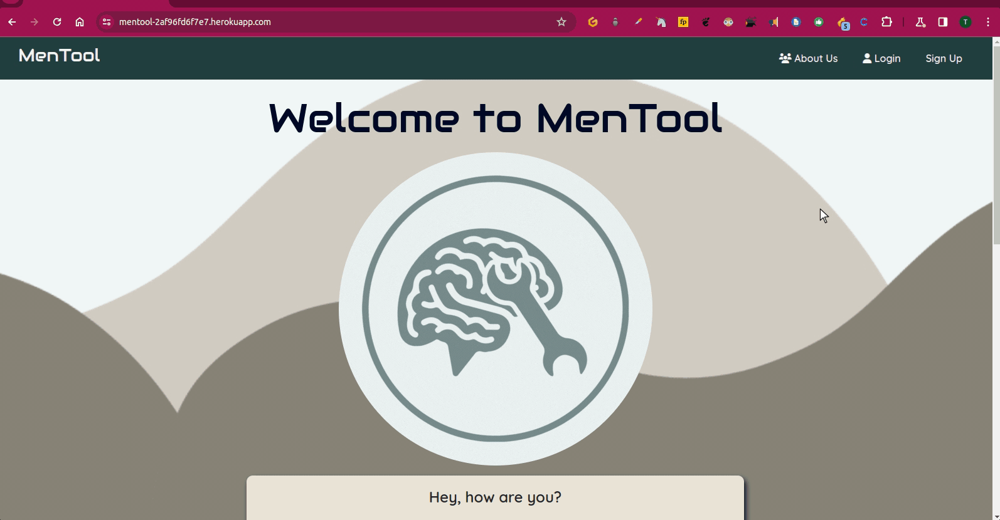
</details>

<details>
<summary>Mood</summary>
<br>
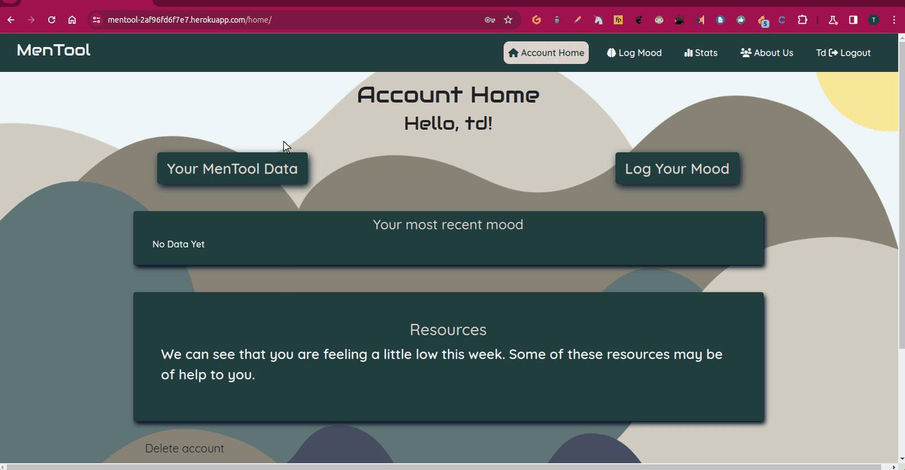
</details>

<details>
<summary>Navbar</summary>
<br>

</details>

<details>
<summary>Sign up</summary>
<br>

</details>

### Database Design
Database design was made with QuickDBD. The database is hosted on ElephantSQL and is a PostgreSQL database.

<details>
<summary>Database Diagram</summary>
<br>
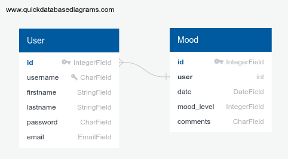 
</details>

# Technologies Used
## Languages
* HTML
* CSS
* JavaScript
* Python


## Frameworks & Tools
* GitHub
* Bootstrap
* Balsamiq
* Google Fonts
* Font Awesome
* Favicon.io
* Django
* Heroku
* Jquery
* Crispyforms
* Cloudenary
* Elephant sql
* Peak


# Features
## Existing Features
### Mood Tracker
The mood tracker allows the user the tracker their mood on the app by clicking on the relivant icons

User stories covered: 1, 10

### Account
The account feature allows the user to login and out of the app keep their data secure

User stories covered: 2, 4, 6

### Mood Analytics
The mood analytics feature allows the user to be able to keep a record of the moods that they've inputed in the mood tracker

User stories covered: 5

### GitHub Profile Link
The Github profile link allows the user to see the acounts of the devs that built the app and see their other work

User stories covered: 8, 11

### Navbar
The navbar allows the user to navigate around the app

User stories covered: 3

### Footer
The footer links back to the about us page which details the devs involved with the app

User stories covered: 8, 11

# Validation
I put my website through the following validation tools:

## HTML Validation


### CSS Validation: 


### Accessibility: 


### Mock up


### Performance


### Device testing
 

### Browser Compatibility


### Testing user stories
1.

| **Feature** | **Action** | **Expected Result** | **Actual Result** |
|-------------|------------|---------------------|-------------------|
|  |  |  |  |


2. 

| **Feature** | **Action** | **Expected Result** | **Actual Result** |
|-------------|------------|---------------------|-------------------|
|  |  |  |  |

3. 

| **Feature** | **Action** | **Expected Result** | **Actual Result** |
|-------------|------------|---------------------|-------------------|
|  |  |  |  |


4.

| **Feature** | **Action** | **Expected Result** | **Actual Result** |
|-------------|------------|---------------------|-------------------|
|  |  |  |  |


5.

| **Feature** | **Action** | **Expected Result** | **Actual Result** |
|-------------|------------|---------------------|-------------------|
|  |  |  |  |


6. 

| **Feature** | **Action** | **Expected Result** | **Actual Result** |
|-------------|------------|---------------------|-------------------|
|  |  |  |  |


7.

| **Feature** | **Action** | **Expected Result** | **Actual Result** |
|-------------|------------|---------------------|-------------------|
|  |  |  |  |


8. 

| **Feature** | **Action** | **Expected Result** | **Actual Result** |
|-------------|------------|---------------------|-------------------|
|  |  |  |  |


9.

| **Feature** | **Action** | **Expected Result** | **Actual Result** |
|-------------|------------|---------------------|-------------------|
|  |  |  |  |


10.

| **Feature** | **Action** | **Expected Result** | **Actual Result** |
|-------------|------------|---------------------|-------------------|
|  |  |  |  |


11.

| **Feature** | **Action** | **Expected Result** | **Actual Result** |
|-------------|------------|---------------------|-------------------|
|  |  |  |  |


12.

| **Feature** | **Action** | **Expected Result** | **Actual Result** |
|-------------|------------|---------------------|-------------------|
|  |  |  |  |


13.

| **Feature** | **Action** | **Expected Result** | **Actual Result** |
|-------------|------------|---------------------|-------------------|
|  |  |  |  |


14. 

| **Feature** | **Action** | **Expected Result** | **Actual Result** |
|-------------|------------|---------------------|-------------------|
|  |  |  |  |


15. 

| **Feature** | **Action** | **Expected Result** | **Actual Result** |
|-------------|------------|---------------------|-------------------|
|  |  |  |  |


16. 

| **Feature** | **Action** | **Expected Result** | **Actual Result** |
|-------------|------------|---------------------|-------------------|
|  |  |  |  |


## Bugs
| **Bug** | **Fix** |
| ----------- | ----------- |
|  |  |
|  |  |
|  |  | 
|  |  |
|  |  |

# Deployment
### Local Deployment

In order to make a local copy of this project, you can clone it. In your IDE Terminal, type the following command to clone the repository:

- `git clone https://github.com/DanMorriss/MenTool.git`

If done locally, the virtual environment needs to be created and activated. To do so, in your IDE Terminal, type the following commands:
```python
python3 -m venv venv
```

If on Linux/MacOS, type the following command for activation:
```
source venv/bin/activate
```
On Windows type the following command for activation:
```
venv\Scripts\activate
```

Alternatively, if using Gitpod, you can click below to create your own workspace using this repository.

[](https://gitpod.io/#https://github.com/DanMorriss/MenTool)

***

After cloning or opening the repository in Gitpod, you will need to:

1. Create your own `.env` file in the root level of the project:

```
SECRET_KEY=[your_secret_key]
DEBUG=True
DATABASE_URL=postgres://[username]:[password]@[host]:[port]/[database_name]
CLOUDINARY_URL=cloudinary://[api_key]:[api_secret]@[cloud_name]
```
**Ensure the `.env` file is added to your `.gitignore` file so it doesn't get pushed to a public repository.

If you don't have a Cloudinary account already, you will need to [Sign Up for Free](https://cloudinary.com/users/register/free) to host the static files in the project.

2. Run `pip3 install -r requirements.txt` to install required Python packages.

3. Setup the SQL database. In this project, PostgreSQL on [ElephantSQL](https://www.elephantsql.com) and put the details in the `.env` file.

3. Migrate the database models using:
`python3 manage.py migrate`

4. Create a superuser with your own credentials:
`python3 manage.py createsuperuser`

5. Run the Django sever:
`python manage.py runserver`
The address of the server will appear in the terminal window.
Add /admin to the address to access the Django admin panel using your superuser credentials.

### Heroku Deployment

Sign up to [Heroku](https://heroku.com/) for free if you don't already have an account.

1. Create a new app in Heroku.

2. In the Resources tab of your app in the Heroku dashboard, click Add-Ons and select Heroku Postgres. Select Hobby Dev - Free as your plan.

3. When Heroku Postgres is installed, click the Settings tab in the Heroku Dashboard.
Click Reveal Config Vars, and add the same variables from your `.env` file here, except for `DEBUG`, as you don't want debug mode on the deployed project.

4. Insert the `SECRET_KEY`, `DATABASE_URL` and `CLOUDINARY_URL` to the Config Vars. 

5. Create a file called `Procfile` (no extension) containing the following:
```
web: gunicorn mentool.wsgi
```

6. Add the url of your Heroku app ('https://mentool-2af96fd6f7e7.herokuapp.com') to your `settings.py` file:

```
ALLOWED_HOSTS = [
    'https://mentool-2af96fd6f7e7.herokuapp.com',...
]
```

7. Disable collect static so that Heroku doesn't try to collect static files when you deploy by adding the following to your Heroku Config Vars in the Settings tab of Heroku dashboard:

```
DISABLE_COLLECTSTATIC=1
```

The same variable has to be removed from Heroku Config Vars when you want to collect static files (for the testing and final deployment).

8. Stage and commit your files to GitHub
```
git add . 
git commit -m "Commit message"
git push
```

9. In the Heroku dashboard for your App, select Deploy.
Under Deployment Method, choose GitHub and search for your repository and click Connect.

10. Select Enable Automatic Deployments, and then Deploy Branch. Heroku will build the App from the branch you selected.

11. Now whenever you push your commits to GitHub, Heroku will rebuild the application.

### Forking the GitHub Repository
The project can be forked in order to make a copy of the original repository and propose changes to the project owner using Pull Requests.
That can be done by following these steps:
First, log in to GitHub and locate the [Project's Repository](https://github.com/DanMorriss/MenTool).
At the top of the Repository, on the right side of the page, locate the "Fork" button.
A copy of the Repository should now be in your GitHub account.
You can now propose changes to the Repository by creating a Pull Request.

### Live deployment
The web site is deployed on Heroku and can be found [here](https://mentool-2af96fd6f7e7.herokuapp.com).

# Credits


## Content


## Media


## Code and Design


# Acknowledgements
